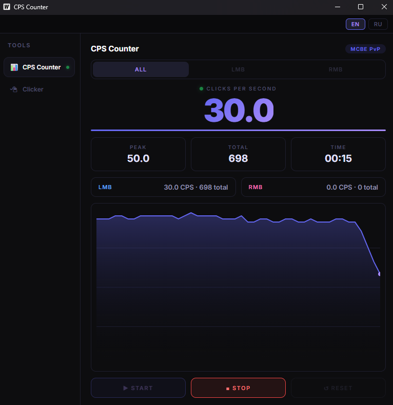

# CPS Counter & Auto Clicker

> Desktop tool for MCBE PvP — built with Go + Wails


## Download

**[⬇ Download latest release](https://github.com/Elmikkox/clicker/releases/latest)**

> Requires Windows 10 / 11. WebView2 is pre-installed on Windows 11. On Windows 10 it will install automatically on first launch.

---



---

## What is this?

A tool built for **Minecraft Bedrock Edition PvP** players who want to track and improve their clicking performance.

**CPS Counter** measures how fast you click in real time — useful for testing your butterfly, jitter or drag clicking technique. It uses a global mouse hook so it counts clicks even when the game window is focused, not the app.

**Auto Clicker** automates mouse clicks with fine-grained control over speed, pattern and timing. It supports human-like randomization to reduce anti-cheat detection, burst patterns, jitter movement, scheduled sessions, macro recording and a click heatmap.

---

## Features

### CPS Counter
- Global mouse hook — counts clicks even when the window is not focused
- Modes: **ALL** / **LMB** / **RMB**
- Real-time graph, peak CPS, total clicks, session timer
- Start / Stop / Reset

### Auto Clicker
- **Uniform** — constant interval between clicks
- **Human** — ±15% random variation to reduce anti-cheat detection
- **Burst** — click bursts with configurable min/max clicks and pause between bursts
- **Jitter** — micro mouse movements on each click (configurable amplitude)
- **Scheduler** — click N seconds → pause M seconds → repeat X times
- **Macro** — record and replay click sequences with exact coordinates and timing
- **Heatmap** — visualize where you click on screen
- **Global hotkeys** — start/stop binds work even while in-game

### UI
- Dark theme
- EN / RU language support
- Resizable window with fluid layout
- Sidebar navigation

---

## Build from source

Requires [Wails v2](https://wails.io) and Go 1.21+.

```bash
wails build -platform windows/amd64
```

## Stack

- **Go** — backend logic, WinAPI hooks, auto clicker engine
- **Wails v2** — Go ↔ JS bridge, native window
- **Vanilla JS** — frontend, no frameworks
- **WinAPI** — `SetWindowsHookEx` for global mouse/keyboard hooks, `SendInput` for click emulation
